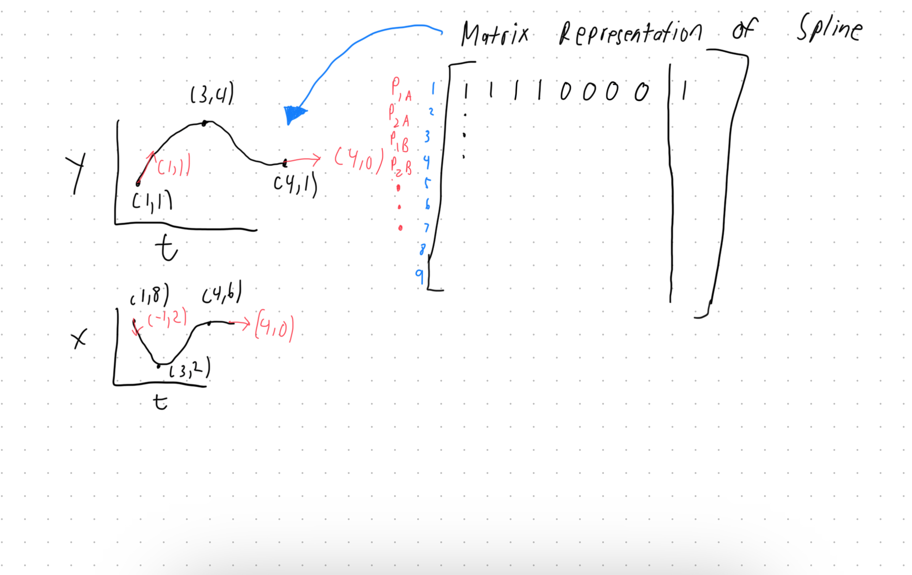

# Summary
This project is the Spline Generation code for the 2024 Utah Lunabotics. High level, this is the code that generates 
the spline using control points. The spline will pass through all the points using C2 continuity. This 
means the spline is continuous up until the second derivative and is therefore a cubic spline. This project has the 
spline generation code with some pseudocode for running it on the robot (filler motor and electrical APIs). 
This project will also have a simulation of the robot following the spline path.

# How it works
The main API call that the user of the application will use the spline generation function. The spline generation function 
will have these parameters:
1. Control Points &rarr; The points that the spline will pass through. Each control point has an x and a y coordinate.
2. Way Points &rarr; The commands that will be run at specific points along the path. Each way point will have a t-value 
and a command. That command can be any function that only has one parameter: the current t-value of the robot.
3. Initial Velocity &rarr; The initial x and y vector of the robot at the start of the spline.
4. Final Velocity &rarr; The final x and y vector of the robot at the end of the spline.

Then using that information and gaussian elimination, the values of the polynomial are solved. Once the path is defined, 
I will be using some conversion math to turn the velocity vector into a driver motor power and a rotation motor power. 
The powers will be bounded by between a min and max value for each. This guarantees that the motors will not be overrun 
causing unnecessary wear and tear. It also guarantees the robot will not stop (even a low motor power can be not enough 
to overcome friction).

# Let's walkthrough a real word example
Let's start with a simple path with 3 control points. For the sake on not being verbose, the Gaussian elimination and 
the full matrix does not have to be completed. But there are 9 that you have to fill (TODO ask Eddie). The functions are 
parameterized by t. There is an x(t) function and a y(t) function. A regular y(x) function can't be used because a path 
is not guaranteed to be a function thus the parameterization. Only the matrix for the y(t) function will be shown because 
the same steps are performed on the x(t) function. Once you solve the matrix with those constraints, the path is defined.
The last column of the matrix are the constants of the polynomial. In the image below, the black dots are the control 
points. The red vectors are the initial and end velocity vectors. Then the matrix representation is of the y(t) function. 
The matrix uses the control points and the initial and end velocity vectors to define the matrix. Then using Gaussian 
Elimination as stated earlier the spline polynomial constants can be found.

Now that the path is defined, we have to have the robot follow it. For this part of the project it is very robot specific. 
This year we are using a tank drivetrain, so rotating the robot is accomplished by running the left and right side at different 
speeds. The path is a parameterized position function. The derivative of that function is the velocity function. The 
velocity is what is mainly useful. Using a simple conversion equation, we can map the velocity to a motor power. The trickiest 
part is the rotation of the robot. Using both vx and vy we can calculate the robot's velocity vector. 
Using the angle and the magnitude of the velocity vector, the drive motor powers can be calculated. Obviously, there will 
be many fine adjustments and additional math to make the robot follow the path as accurately as possible. However, I am 
first going to make sure the code works in a perfect environment knowing I'll have to make adjustments for the real world. 
At this point, however, starting with a perfect environment is sufficiently complicated. I know I don't know enough at this 
point to start writing code without further research. So for know I am writing the API documentation to get a general idea 
of what to do. Then after enough research, I will start writing the actual code. In past projects, the solution had to be 
restarted because my original design was not the correct choice. I realized after two months of experimentation, so I am 
being careful now to avoid future pain.

# Closing Thoughts
As with any complicated project, this documentation is oversimplified because it is high level. The fine details will be 
documented in the API documentation. This is still a work in progress, so the documentation will be updated as the 
project progresses and I learn more through experimentation on the robot.